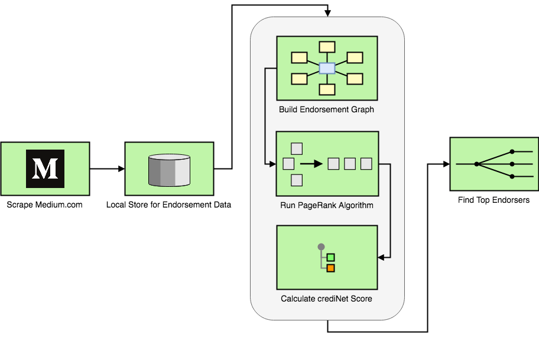
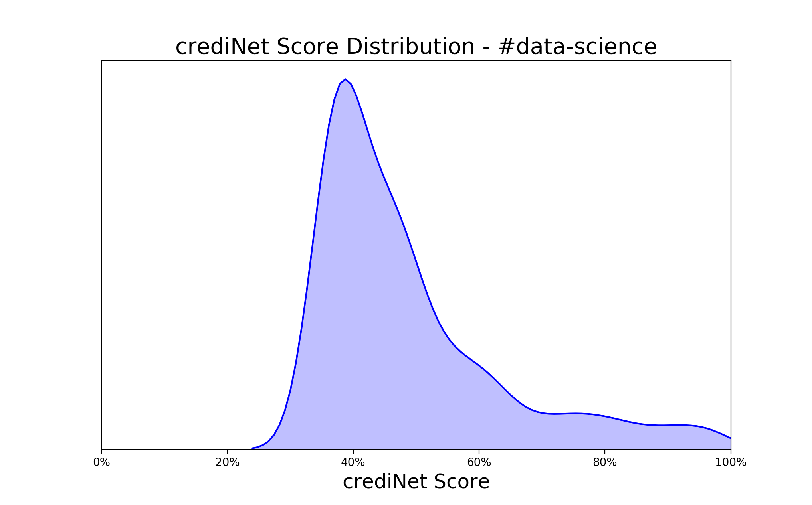

# CRENG - The Credibility Scoring Engine for Media

> CRENG evaluates an author's credibility in a topic if other credible authors in the network endorse her/him in that particular topic. That simple. 

We have done this for Medium.com : 

Here is a sample distribution of credibility scores for topic #data-science :

